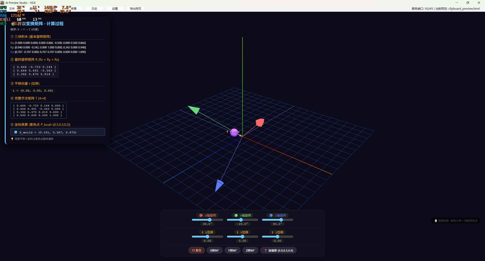

# AI Preview Studio

> AI Output Runtime System — AI 生成内容的即时预览与一键导出系统


## 解决什么问题？

使用 AI 编程或者网页使用时，你一定遇到过：

- **AI 输出的 HTML/Markdown 代码无法直接预览** — 需要复制 → 新建文件 → 保存 → 打开浏览器
- **AI 输出无法一键变成磁盘上的文件** — 没有"一键落地"的手段
- **当前对话直接打开 HTML/Mermaid 文件体验差** — 页面被拆分成两三个区域显示，代码和预览挤在一起，根本没法看

AI Preview Studio 就是为了解决这几个痛点：**复制即预览，Ctrl+S 即导出**。

## 核心功能

### 📋 剪贴板智能监听

复制 AI 输出的内容，程序自动识别类型并渲染预览：

| 内容类型 | 识别方式 | 渲染引擎 |
|---------|---------|---------|
| **HTML** | 标签结构分析 | Chromium 内核直渲染 |
| **Markdown** | 多阶段启发式规则 | marked.js + highlight.js |
| **SVG** | XML 声明 + 根标签检测 | Chromium 内核 + 透明网格背景 |
| **Mermaid** | `graph`/`flowchart`/`sequenceDiagram` 等关键字 | mermaid@10 + svg-pan-zoom |

### 📂 文件/文件夹监控

- 选择文件后自动监听变化，修改即刷新
- 支持整个项目文件夹监控，新增文件自动加载

### 💾 一键导出

- `Ctrl+S` 快速导出
- 支持 HTML / Markdown / SVG / Mermaid 四种格式
- SVG 和 Mermaid 额外支持导出为 PNG / JPEG 栅格图片
- 导出后自动在资源管理器中高亮定位

### 🛠️ HTML 自动修复

AI 截断输出的 HTML 自动补全未闭合标签（`<style>`、`<script>` 及嵌套容器标签），保证渲染完整性。

### 🖥️ 系统托盘常驻

最小化到后台运行，检测到剪贴板新内容自动弹出预览窗口。

## 截图



## 快速开始

### 环境要求

- Windows 10/11
- Python 3.13+

### 安装

```bash
# 克隆仓库
git clone https://github.com/Rsamv/AI-Preview-Studio.git
cd AI-Preview-Studio

# 创建虚拟环境
python -m venv .venv
.venv\Scripts\activate

# 安装依赖
pip install -r requirements.txt
```

### 运行

```bash
python main.py
```

### 打包为 EXE

```bash
pyinstaller AIPreviewStudio.spec
```

打包产物在 `dist/AIPreviewStudio.exe`。

## 项目结构

```
AI Preview Studio/
├── main.py                  # 入口：单实例锁 + QApplication 启动
├── core/
│   ├── config.py            # 应用配置常量
│   ├── server.py            # 本地 HTTP 服务器 (加载 CDN 资源)
│   ├── repairer.py          # HTML 标签栈自动修复
│   └── exporter.py          # 导出系统 (HTML/MD/SVG/Mermaid)
├── ui/
│   └── main_window.py       # 主窗口 (UI 布局 + 核心业务逻辑)
├── preview/
│   └── webview.py           # QWebEngineView 封装 + Ctrl+S 拦截
├── requirements.txt         # Python 依赖
├── AIPreviewStudio.spec     # PyInstaller 打包配置
└── logo.ico                 # 应用图标
```

## 技术栈

| 层级 | 技术 |
|-----|------|
| UI 框架 | PySide6 (Qt for Python) |
| Web 渲染 | QWebEngineView (Chromium 内核) |
| 本地服务 | Python `http.server` (随机端口，支持 CORS) |
| Markdown | marked.js + highlight.js + github-markdown-css |
| 流程图 | Mermaid@10 + svg-pan-zoom |
| 打包 | PyInstaller |

## 配置

程序运行后会在工作目录生成 `.preview_cache/config.json`，可配置项：

| 配置项 | 默认值 | 说明 |
|-------|-------|------|
| `use_http` | `true` | 是否使用本地 HTTP 服务器加载预览 |
| `clipboard_monitor` | `true` | 是否监听剪贴板变化 |
| `file_monitor` | `true` | 是否监听文件变化 |
| `auto_repair` | `true` | 是否自动修复截断的 HTML |
| `auto_raise` | `true` | 检测到新内容时是否自动弹出窗口 |
| `min_to_tray` | `true` | 关闭时是否最小化到托盘 |
| `always_on_top` | `false` | 是否窗口置顶 |

## 开发路线

- [x] V0.1 - 基础 HTML 预览
- [x] V0.2 - 文件/文件夹导入 + HTTP 服务器
- [x] V0.3 - 文件变化自动刷新
- [x] V0.4 - 剪贴板监听 + 智能识别
- [x] V0.5 - 一键导出系统
- [x] V0.6 - 多格式智能识别 (HTML/MD/SVG)
- [x] V0.7 - Mermaid 流程图 + 交互缩放
- [ ] V1.0 - 稳定发布版

## License

MIT
